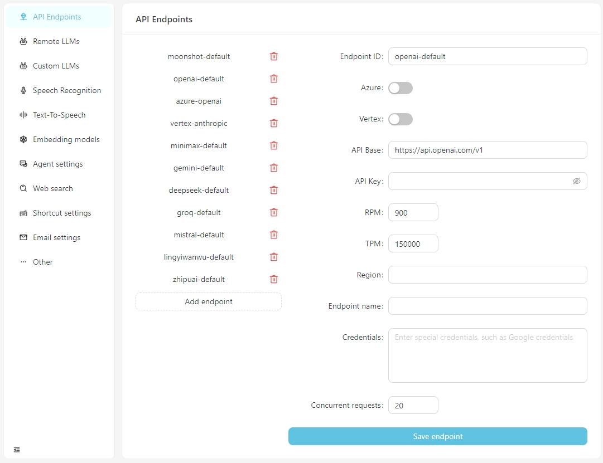
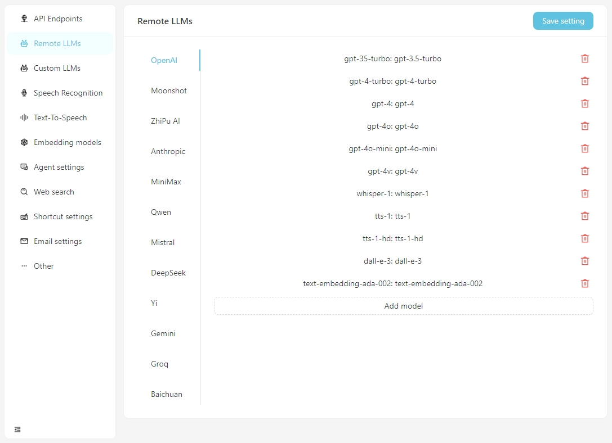
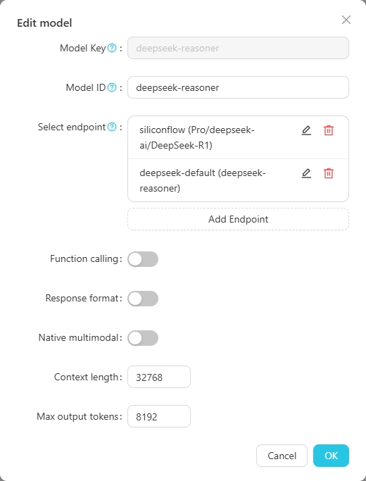
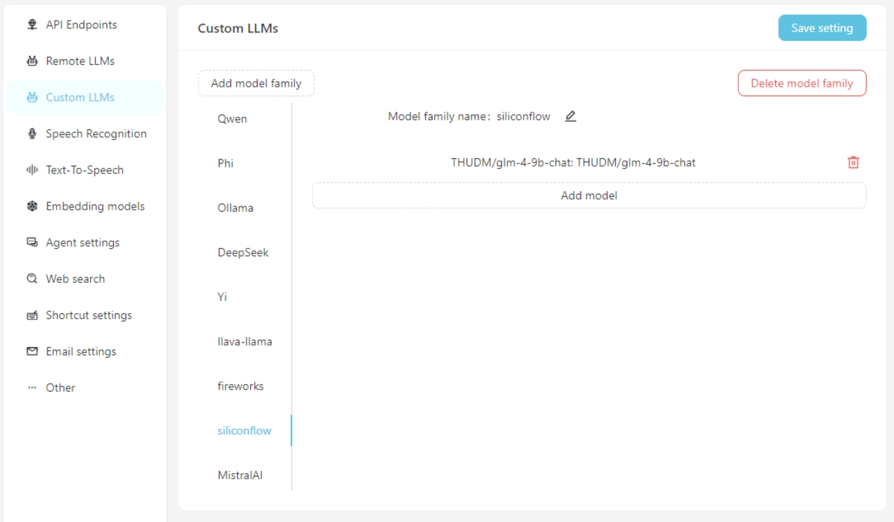

 [English](README_en.md) | [简体中文](README_zh.md) | 日本語

 [](https://vectorvein.com)

# 🔀 ベクトル静脈 VectorVein

AIの力を利用して、個人の知識ベースと自動化ワークフローを構築します。

プログラミング不要で、ドラッグ＆ドロップだけで強力なワークフローを作成し、すべてのタスクを自動化します。

 [](https://github.com/AndersonBY/vector-vein)

ベクトル静脈は、[LangChain](https://github.com/hwchase17/langchain) および [langflow](https://github.com/logspace-ai/langflow) に触発されて開発されたノーコードAIワークフローソフトウェアであり、大規模言語モデルの強力な能力を組み合わせ、ユーザーが簡単なドラッグ＆ドロップで日常のさまざまなワークフローをインテリジェントかつ自動化することを目的としています。

## 🌐 オンライン体験

[こちら](https://vectorvein.com) でベクトル静脈のオンライン版を体験できます。ダウンロードやインストールは不要です。

公式サイト [オンラインドキュメント](https://vectorvein.com/help/docs/introduction)

## 📦 インストールと設定

### インストール

[リリースページ](https://github.com/AndersonBY/vector-vein/releases/) からVectorVeinをダウンロードし、プログラムを開くと、インストールディレクトリにデータベースと静的ファイルリソースを保存するための「data」フォルダが作成されます。

VectorVeinはpywebviewを使用して構築されており、webview2ランタイムが必要です。ソフトウェアが開かない場合は、webview2ランタイムを手動でダウンロードする必要があるかもしれません。ダウンロードリンク：[https://developer.microsoft.com/ja-jp/microsoft-edge/webview2/](https://developer.microsoft.com/ja-jp/microsoft-edge/webview2/)

> [!IMPORTANT]
> 解凍後にソフトウェアが開かない場合は、ダウンロードした圧縮パッケージ .zip ファイルがロックされているかどうかを確認してください。右クリックして「ブロックを解除」を選択して解決できます。

### 設定

ソフトウェアのほとんどのワークフローやエージェントはAI大規模言語モデルの使用を伴うため、少なくとも1つの大規模言語モデルの有効な設定を提供する必要があります。ワークフローでは、使用する大規模言語モデルをインターフェースで確認できます。以下の画像のように。


#### APIエンドポイント設定

v0.2.10から、VectorPulseはAPIエンドポイントと大規模言語モデルの設定を分離し、同じ大規模言語モデルに対して複数のAPIエンドポイントを設定できるようになりました。



ソフトウェアが正常に起動した後、設定を開くボタンをクリックすると、各APIエンドポイントの情報を必要に応じて設定したり、カスタムAPIエンドポイントを追加したりできます。現在、APIエンドポイントはOpenAI互換のインターフェースをサポートしており、LM-Studio、Ollama、vLLMなどのローカルで実行されるサービスに接続できます。

> LM-StudioのAPIベースは通常 http://localhost:1234/v1/ です。
> 
> OllamaのAPIベースは通常 http://localhost:11434/v1/ です。

#### リモート大規模言語モデルインターフェース設定

各モデルの具体的な情報を `Remote LLMs` タブで設定してください。



任意のモデルをクリックして、その具体的な設定を行います。



`Model Key` は大規模モデルの標準名であり、通常は調整する必要はありません。`Model ID` は実際のデプロイ時に使用される名前で、通常は `Model Key` と一致します。ただし、Azure OpenAIのようなデプロイでは、`Model ID` はユーザー定義であり、実際の状況に応じて調整する必要があります。

#### カスタム大規模言語モデルインターフェース設定

カスタム大規模言語モデルを使用する場合、`Custom LLMs` タブでカスタムモデルの設定情報を入力してください。現在、OpenAI互換のインターフェース（LM-Studio、Ollama、vLLMなど）がサポートされています。



まず、カスタムモデルファミリーを追加し、次にカスタムモデルを追加します。`Save Settings` ボタンをクリックするのを忘れないでください。

#### 音声認識の設定

現在、OpenAI/Deepgramの音声認識サービスがサポートされています。OpenAIサービスの場合、大規模言語モデルと同じ設定を使用するか、OpenAI API互換の音声認識サービス（Groqなど）を設定できます。


### 埋め込み設定

ベクトルデータを使用してベクトル検索を実行する必要がある場合、OpenAIが提供する埋め込み（Embedding）サービスを使用するか、「埋め込みモデル」設定でローカルの埋め込みサービスを設定できます。現在、サポートされているローカル埋め込みサービスは、[text-embeddings-inference](https://github.com/huggingface/text-embeddings-inference)を自分でセットアップする必要があります。


### ショートカット設定

日常の使用を容易にするために、エージェントとの音声会話を迅速に開始するためのショートカットを設定できます。ショートカットを使用して起動すると、音声認識を介してエージェントと直接対話できます。事前に音声認識サービスが正しく設定されていることを確認することが重要です。

**スクリーンショットを含む**とは、会話を開始すると同時に画面のスクリーンショットを撮り、会話に添付ファイルとしてアップロードすることを意味します。


#### ローカルのStable Diffusion APIについて

自分のローカルで実行しているStable Diffusion APIを使用するには、webui-user.batの起動項目に--apiパラメータを追加する必要があります。つまり、

```
set COMMANDLINE_ARGS=--api
```

## 💻 使用方法

### 📖 基本概念

ワークフローは、入力、出力、および入力がどのように処理されて出力結果に到達するかを含む作業タスクプロセスを表します。

いくつかの例：

- **翻訳ワークフロー**：入力は英語のWord文書で、出力もWord文書です。入力された中国語文書を翻訳して中国語文書を生成するワークフローを設計できます。
- **マインドマップワークフロー**：翻訳ワークフローの出力をマインドマップに変更すると、英語のWord文書を読み取り、中国語のマインドマップに要約するワークフローを取得できます。
- **ウェブ記事の要約ワークフロー**：マインドマップワークフローの入力をウェブ記事のURLに変更すると、ウェブ記事を読み取り、中国語のマインドマップに要約するワークフローを取得できます。
- **顧客の苦情の自動分類ワークフロー**：入力は苦情内容を含む表で、分類する必要があるキーワードをカスタマイズできます。苦情を自動的に分類し、分類結果を含むExcel表を自動生成します。

### 🔎 ユーザーインターフェース

各ワークフローには**ユーザーインターフェース**と**エディターインターフェース**があります。ユーザーインターフェースは日常のワークフロー操作に使用され、エディターインターフェースはワークフローの編集に使用されます。通常、ワークフローを設計した後は、ユーザーインターフェースで実行するだけで、エディターインターフェースで変更する必要はありません。


ユーザーインターフェースは上記のように表示され、入力、出力、およびトリガー（通常は実行ボタン）の3つの部分に分かれています。日常の使用では、直接内容を入力し、実行ボタンをクリックして結果を出力エリアで確認できます。

実行されたワークフローを表示するには、**ワークフロー実行記録**をクリックします。以下の図のように表示されます。


### ✏️ ワークフローの作成

公式テンプレートを自分のワークフローに追加するか、新しいワークフローを作成できます。最初は公式テンプレートを使用してワークフローの使用方法に慣れることをお勧めします。


ワークフローエディターインターフェースは上記のように表示されます。上部で名前、タグ、および詳細な説明を編集できます。左側はワークフローのノードリスト、右側はワークフローのキャンバスです。左側から必要なノードをドラッグしてキャンバスに配置し、ノードを接続してワークフローを形成します。

簡単なクローラー+AI要約マインドマップワークフローの作成チュートリアルを[こちら](TUTORIAL_ja.md)で確認できます。

この[オンラインインタラクティブチュートリアル](https://vectorvein.com/workspace/workflow/editor/tutorial)も試してみてください。

## 🛠️ 開発とデプロイ

### 環境要件

- バックエンド
  - Python 3.8 ~ Python 3.11
  - [PDM](https://pdm.fming.dev/latest/#installation)のインストール

- フロントエンド
  - Vue3
  - Vite

### プロジェクト開発

**backend**ディレクトリで以下のコマンドを実行して依存関係をインストールします：

#### Windows
```bash
pdm install
```

#### Mac
```bash
pdm install -G mac
```

通常、PDMはシステムのPythonを自動的に見つけ、仮想環境を作成して依存関係をインストールします。

インストールが完了したら、以下のコマンドを実行してバックエンド開発サーバーを起動し、実行結果を確認します：

```bash
pdm run dev
```

フロントエンドコードを変更する必要がある場合は、**frontend**ディレクトリで以下のコマンドを実行して依存関係をインストールします：

```bash
pnpm install
```

> プロジェクトコードを初めてプルする場合も、`pnpm install`を実行してフロントエンド依存関係をインストールする必要があります。
>
> フロントエンドコードをまったく開発する必要がない場合は、リリースバージョンから`web`フォルダを`backend`フォルダにコピーするだけで済みます。

フロントエンド依存関係がインストールされたら、フロントエンドコードをバックエンドの静的ファイルディレクトリにコンパイルする必要があります。プロジェクトにはショートカットコマンドが提供されています。**backend**ディレクトリで以下のコマンドを実行してフロントエンドリソースをパッケージングおよびコピーします：

```bash
pdm run build-front
```

### データベース構造の変更

> [!WARNING]
> データベース構造を変更する際は、まずデータベース（設定された data ディレクトリ内の `my_database.db`）をバックアップしてください。そうしないとデータが失われる可能性があります。

`backend/models` ディレクトリ下的モデル構造を変更した場合、以下のコマンドを `backend` ディレクトリで実行してデータベース構造を変更する必要があります：

まず Python 環境に入ります：

```bash
pdm run python
```

```python
from models import create_migrations
create_migrations("migration_name")  # 変更内容に基づいて名前を付けます
```

操作が完了すると、`backend/migrations` ディレクトリ下に新しい移行ファイルが生成されます。移行ファイルの名称は `xxx_migration_name.py` となります。まず移行ファイルの内容が正しいか確認することをお勧めします。その後、主プログラムを再実行し、主プログラムが自動的に移行を実行します。

### ソフトウェアのパッケージング

プロジェクトはpyinstallerを使用してパッケージングされています。**backend**ディレクトリで以下のコマンドを実行して実行可能ファイルにパッケージングします：

```bash
pdm run build
```

パッケージングが完了すると、**backend/dist**ディレクトリに実行可能ファイルが生成されます。

## 📄 ライセンス

ベクトル静脈はオープンソースソフトウェアであり、個人の非商用利用をサポートしています。具体的な契約については、[LICENSE](LICENSE.md)を参照してください。
