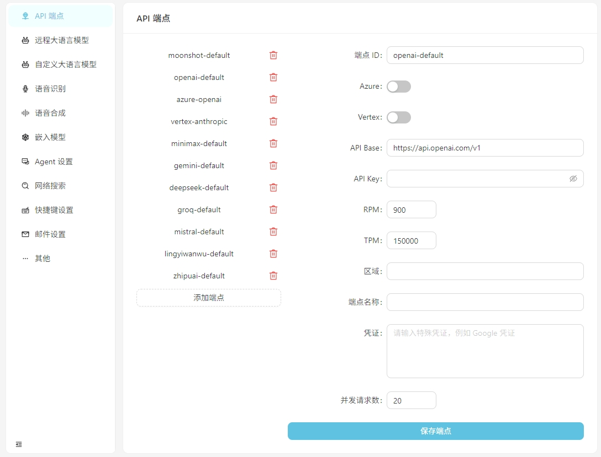
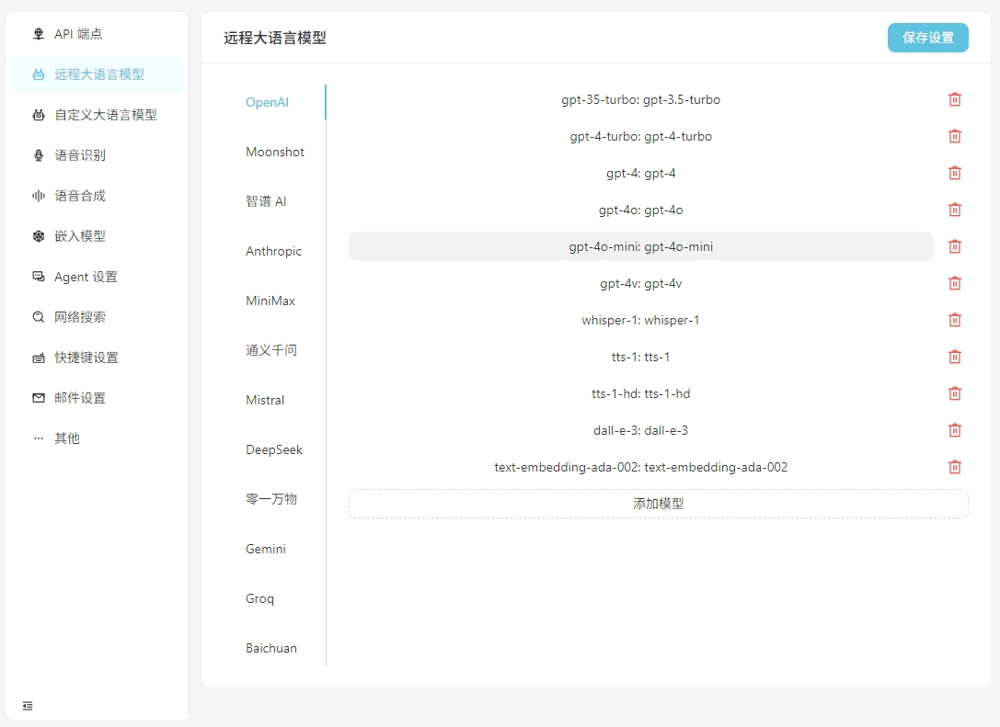
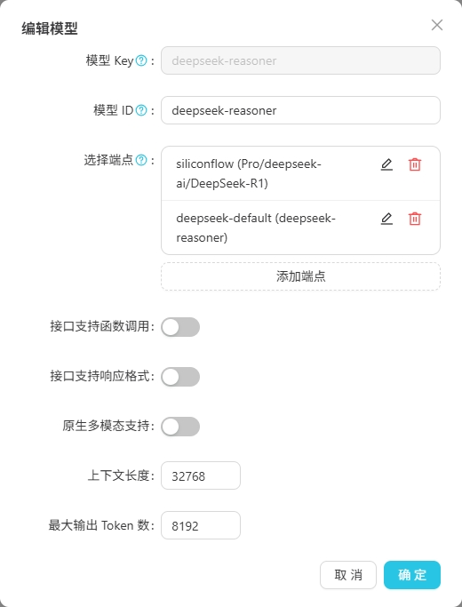
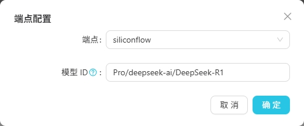
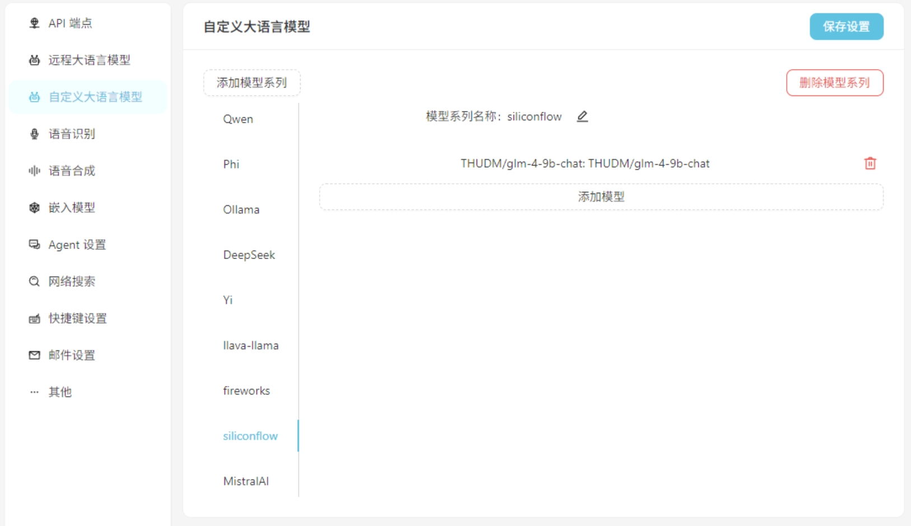
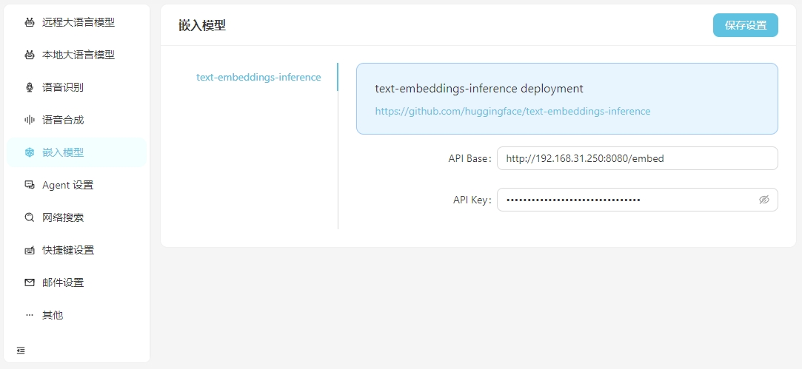
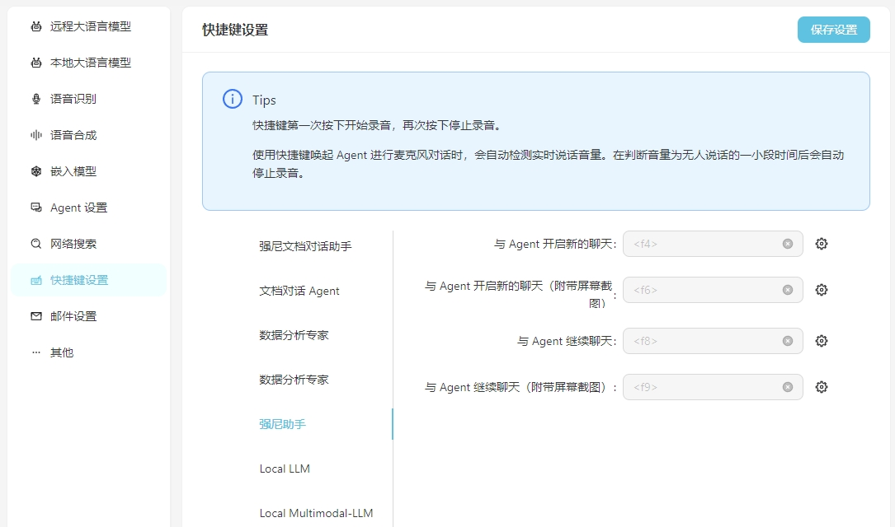

 [English](README_en.md) | 简体中文 | [日本語](README_ja.md)

 [](https://vectorvein.com)

# 🔀 向量脉络 VectorVein

利用 AI 的力量构建您的个人知识库+自动化工作流程。

无需编程，只需拖拽即可创建强大的工作流，自动化所有任务。

 [](https://github.com/AndersonBY/vector-vein)

向量脉络是受到 [LangChain](https://github.com/hwchase17/langchain) 以及 [langflow](https://github.com/logspace-ai/langflow) 的启发而开发的无代码 AI 工作流软件，旨在结合大语言模型的强大能力并让用户通过简单的拖拽即可实现各类日常工作流的智能化和自动化。

## 🌐 在线体验

您可以在 [这里](https://vectorvein.com) 体验向量脉络的在线版本，无需下载安装。

官方网站 [在线文档](https://vectorvein.com/help/docs/introduction)

## 📦 安装及配置

### 安装

在 [Release 页下载](https://github.com/AndersonBY/vector-vein/releases/) 后打开 VectorVein 软件，初次打开时程序会在安装目录下创建 data 文件夹，用于存放数据库及静态文件资源。

软件采用了 pywebview 搭建，基于 webview2 内核，因此需要安装 webview2 运行时，如果出现软件无法打开，可能需要手动下载 webview2 运行时，下载地址： [https://developer.microsoft.com/zh-cn/microsoft-edge/webview2/](https://developer.microsoft.com/zh-cn/microsoft-edge/webview2/)

> [!IMPORTANT]
> 如果解压缩后无法运行，请检查下载下来的压缩包 .zip 文件是否被锁定，可以通过右键点击压缩包选择“解除锁定”来解决。

### 配置

软件的大部分工作流、Agent 都会涉及 AI 大语言模型的使用，因此您应该至少提供一个大语言模型的可用配置。对于工作流您可以在使用界面看到其使用了哪些大语言模型，如下图。


#### API 端点配置

从 v0.2.10 开始，向量脉络将 API 端点和大语言模型配置分开，同一个大语言模型可以有多个 API 端点。



软件正常打开后点击打开设置按钮，您可以根据需要配置每个 API 端点的信息，也可以新增自定义的 API 端点。目前的 API 端点支持 OpenAI 兼容的接口，可接入本地运行的如 LM-Studio、Ollama、vLLM 等。

> LM-Studio 的 API Base 通常为 http://localhost:1234/v1/
> 
> Ollama 的 API Base 通常为 http://localhost:11434/v1/

#### 远程大语言模型接口配置

请在 `远程大语言模型` 标签页配置每个模型的具体信息。



单击任意模型后可以设置该模型的具体配置，如下图。



> 其中 `模型 Key` 是大模型的标准名称，一般不需要调整。`模型 ID` 是实际部署时的名称，一般情况下与 `模型 Key` 一致，但是在 Azure OpenAI 等部署中 `模型 ID` 是由用户自定义的，因此需要根据实际情况调整。
>
> 由于同一模型的不同提供商的模型 ID 可能不同，您可以点击 `编辑` 按钮来配置该端点下该模型的具体模型 ID，如下图。
>
> 

#### 自定义大语言模型接口配置

如果使用自定义大语言模型在 `自定义大语言模型` 标签页填入自定义的模型配置信息。目前支持 OpenAI 兼容的接口，如 LM-Studio、Ollama、vLLM 等。



首先增加自定义模型系列，然后增加自定义模型。不要忘记点击 `保存设置` 按钮。

#### 语音识别配置

目前支持使用 OpenAI/Deepgram 的语音识别服务。对于 OpenAI 服务，可以采用与大语言模型相同的配置，也可以设置与 OpenAI 接口兼容的语音识别服务（如 Groq）。


#### 嵌入配置

当您需要使用向量数据的向量搜索时，您可以选择使用 OpenAI 提供的嵌入（Embedding）服务，也可以在设置的 `嵌入模型` 中配置本地的嵌入服务。目前支持的本地嵌入服务需要您自行搭建 [text-embeddings-inference](https://github.com/huggingface/text-embeddings-inference) 来提供。



### 快捷键设置

为方便日常使用，您可以配置快捷键以快速开启和 Agent 的语音对话。通过快捷键启动即可直接通过语音识别与 Agent 对话。一定注意前提是语音识别服务已经正确配置完成。

其中 **附带屏幕截图** 是指在开启聊天的同时对屏幕进行截图并作为附件上传到对话中。



#### 关于本地的 Stable Diffusion API

为了能够使用您自己本地运行的 Stable Diffusion API，您需要在 webui-user.bat 的启动项加上参数 --api，即

```
set COMMANDLINE_ARGS=--api
```

## 💻 使用方式

### 📖 基本概念

一个工作流代表了一个工作任务流程，包含了输入、输出以及工作流的触发方式。你可以任意定义输入是什么，输出是什么，以及输入是如何处理并到达输出结果的。

几个例子：

-   **翻译工作流**，输入是一个英文的 Word 文档，输出也是 Word 文档，你可以设计工作流将输入的中文文档翻译后生成中文文档。
-   **思维导图工作流**，如果将翻译工作流的输出改为思维导图，那么你就可以得到一个读取英文 Word 文档并总结为中文思维导图的工作流。
-   **网络文章摘要工作流**，如果将思维导图工作流的输入改为网络文章的 URL，那么你就可以得到一个读取网络文章并总结为中文思维导图的工作流。
-   **客户差评自动分类工作流**，输入是一个包含差评内容的表格，并自定义需要分类的关键词，即可自动将差评分类，输出就是自动生成包含分类结果的 Excel 表格。

### 🔎 使用界面

每个工作流都有一个**使用界面**和一个**编辑界面**，使用界面用于日常运行工作流，编辑界面用于编辑工作流。通常而言一个设计好的工作流您平时只需要在使用界面中运行即可，不需要再去编辑界面中修改。


使用界面如上所示，分为输入、输出、触发器 ( 通常是一个运行按钮 ) 三个部分。日常使用可以直接输入内容，点击运行按钮即可在输出看到结果。

想查看运行过的工作流可以点击【工作流运行记录】，如下图所示。


### ✏️ 创建工作流

您可以添加我们提供的官方模板到自己的工作流中，也可以自己创建一个新的工作流。刚开始时建议先用官方模板熟悉一下工作流的使用。


工作流编辑界面如上图所示，顶部可以编辑名称、标签以及详细描述。左侧是工作流的节点列表，右侧是工作流的画布，您可以从左侧找到想要的节点拖拽到画布中，然后通过连线连接节点，形成工作流。

您可以查看一个简易的 爬虫 + AI 总结思维导图工作流的 [创建教学](TUTORIAL_zh.md) 。

还可以试一下这个 [在线互动教程](https://vectorvein.com/workspace/workflow/editor/tutorial) 。

## 🛠️ 开发部署

### 环境要求

- 后端
  - Python 3.8 ~ Python 3.11
  - 安装 [PDM](https://pdm.fming.dev/latest/#installation)

- 前端
  - Vue3
  - Vite

### 项目开发

在 **backend** 目录下运行以下命令安装依赖：

#### Windows
```bash
pdm install
```

#### Mac
```bash
pdm install -G mac
```

正常来说 PDM 会自动找到系统的 Python 并创建虚拟环境以及安装依赖。

安装完成后运行以下命令启动后端开发服务即可看到运行效果：

```bash
pdm run dev
```

如果需要修改前端代码，需要在 **frontend** 目录下运行以下命令安装依赖：

```bash
pnpm install
```

> 初次拉取项目代码也需要运行 `pnpm install` 安装前端依赖。
> 
> 如果完全不需要开发前端代码，可以直接从发行版中把 `web` 文件夹复制到 `backend` 文件夹下。

前端依赖安装完成后需要将前端代码编译到后端的静态文件目录中，项目已提供了快捷指令，在 **backend** 目录下运行以下命令实现前端资源打包及拷贝：

```bash
pdm run build-front
```

### 数据库结构变更

> [!WARNING]
> 进行数据库结构变更时，请先备份数据库（在您配置的 data 目录下的 `my_database.db`），否则可能会导致数据丢失。

如果修改了 `backend/models` 下的模型结构，需要在 `backend` 目录下运行以下命令进行数据库结构变更：

首先进入 Python 环境：

```bash
pdm run python
```

```python
from models import create_migrations
create_migrations("migration_name")  # 根据变更内容命名
```

操作完成后会在 `backend/migrations` 目录下生成一个新的迁移文件，迁移文件名称为 `xxx_migration_name.py`。建议先检查迁移文件内容是否正确，然后重新运行主程序，主程序会自动执行迁移。

### 软件打包

项目采用 pyinstaller 进行打包，在 **backend** 目录下运行以下命令即可打包成可执行文件：

```bash
pdm run build
```

打包完成后会在 **backend/dist** 目录下生成可执行文件。

## 📄 协议

向量脉络是一个开源的软件，支持个人非商业使用，具体协议请参考 [LICENSE](LICENSE.md) 。
