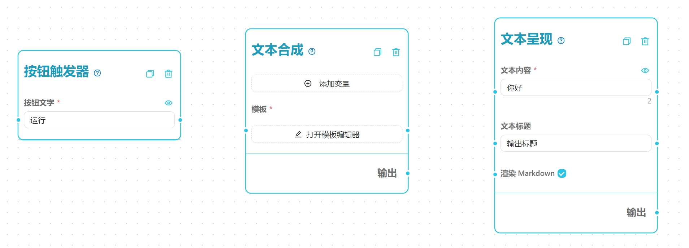
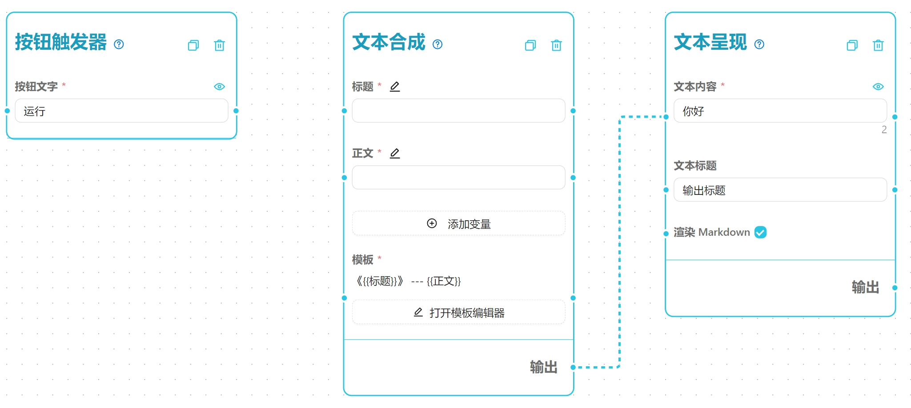
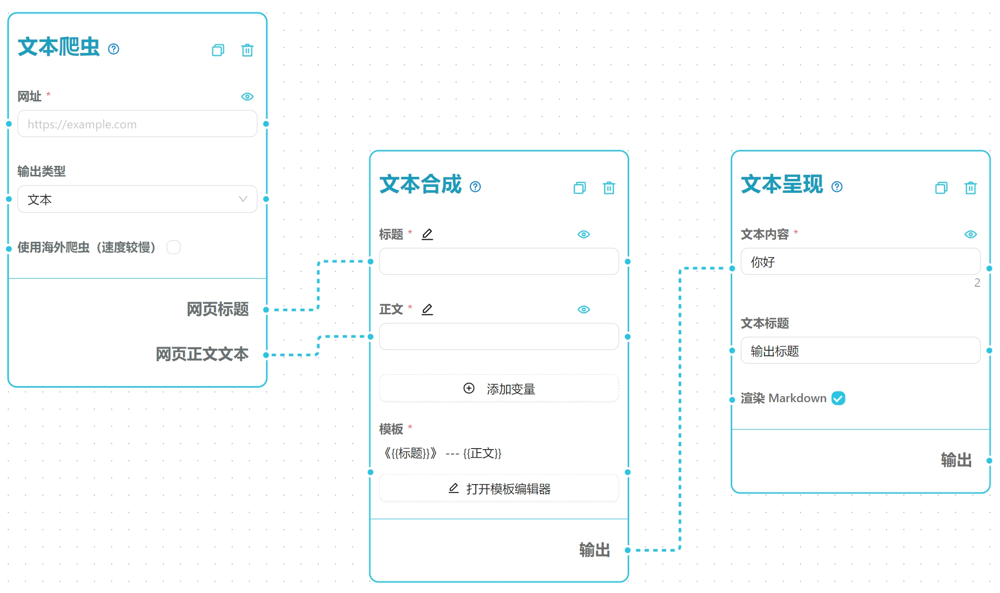
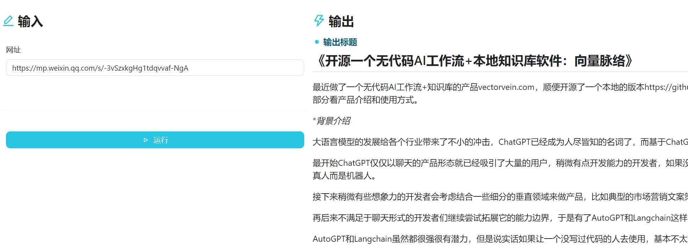
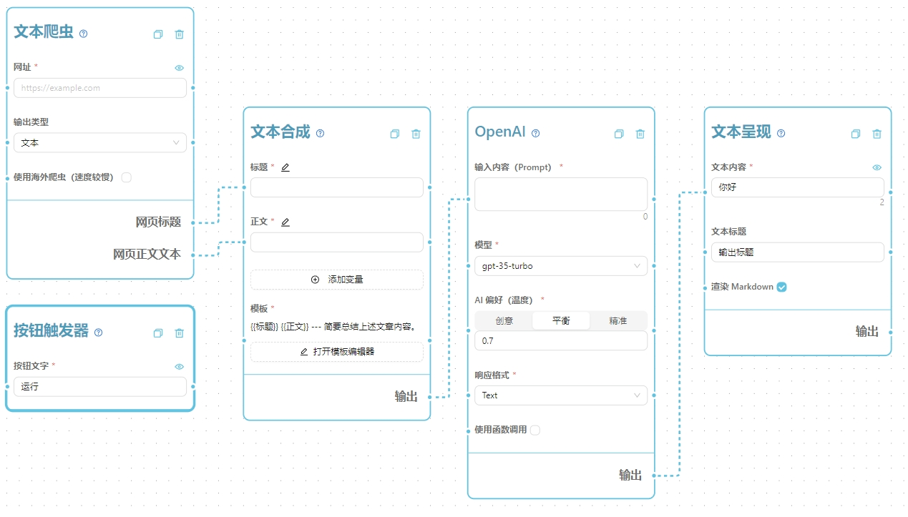
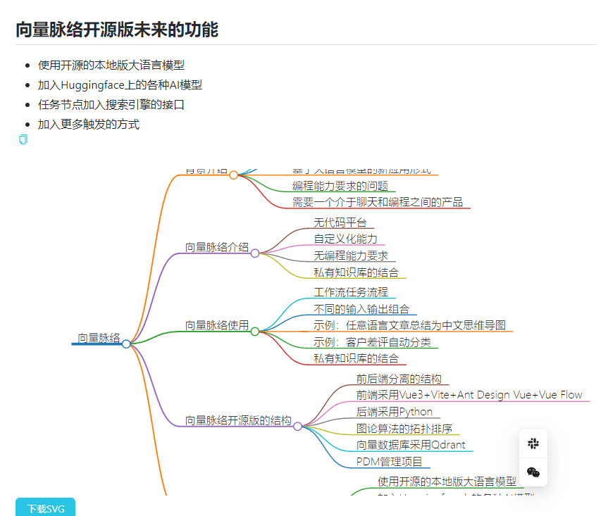

在尝试过一些现成的工作流模板以后，你大概也想尝试自己动手创建一个工作流了。这篇指南将会帮助你完成这个过程。

你也可以直接试试我们的 [在线互动教程](https://vectorvein.com/workspace/workflow/tutorial) 。

## ✌️ 总体思想

#### 使用界面设计思想

首先要明确一点，我们设计工作流的目的是为了让未来的相似工作流程更加高效，因此我们需要思考哪些信息是在未来每次运行工作流的时候有可能发生变化的。这些可能会发生变化的信息我们就提取出来作为每次运行工作流的输入，其它不会发生改变的信息我们就直接在编辑工作流时写好，并且不需要展示在工作流的使用界面中。

显然下图中左边的设计就没有右边的简洁，因为模板信息每次都一样的，没有必要呈现在使用界面中。


#### 工作流开发思想

在开始设计工作流时，不要着急一口吃成个胖子，而是应该先从一个最简单的只有几个节点的版本开始，然后再逐步迭代。一定记住每添加了几个节点并连线完成后先测试运行一下看看是否有问题，然后再继续。这样做的好处是，可以让你在开发过程中更容易发现问题，而不是等到工作流开发完成后才发现问题，这样会浪费很多时间。

## 🏫 快速开发教程

下面我将以一个简单的**翻译+AI 总结思维导图**工作流为例，来演示如何快速开发一个工作流。通过这个教程，你将学会工作流编辑器的基本使用方法以及一些基本的概念，同时一些使用中的注意事项也会穿插在这个教程中进行介绍。

创建一个新的空工作流，在工作流详情页面点击 **【更多操作】 ->【编辑】** 按钮打开编辑页面。

从左侧找到**触发器->按钮触发器**节点，拖拽到画布中。

从左侧找到**输出->文本呈现**节点，拖拽到画布中。

在**文本呈现**节点的文本内容端口里写上一句话比如 `你好`，在文本标题端口里写上一句话比如 `输出标题`。

目前您的画布应该是这样的：


> 注意：**按钮触发器** 平时只需要放置在画布上即可，它作为特殊的节点**不需要**与其它节点连接。
>
> 注意：**文本呈现**中的**文本标题**是用于显示在使用界面的标题，当您的输出中有多个文本内容需要呈现时可通过这个标题来进行区分。

现在我们先点击**界面设计**预览使用界面，你会看到触发器区域有一个按钮，输出区域多了一些文本内容，效果如下图所示：


接下来我们继续点回**工作流画布**页面，从左侧找到**文本处理->文本合成**节点，拖拽到画布中。**文本合成**节点的作用是将多个文本内容按照设计好的模板合成为一个完整的文本内容。现在画布效果如下图所示：


现在在**文本合成**节点点击添加变量，在打开的抽屉中输入一个变量名称 ` 标题 `，然后点击**添加**按钮，再输入一个变量名称 ` 正文 `，并且将输入类型选为多行输入框，然后点击**添加**按钮，目前您的**文本合成**节点应该是这样的：


接下来我们在模板里写上一些内容，来表示要如何合成我们想要的文本内容效果。首先要注意的是在模板里使用变量时，需要使用 `{{变量名称}}` 的格式，比如我们要将标题和正文合成为一个完整的文本内容，那么模板就可以写成这样：
```
《{{标题}}》
---
{{正文}}
```
这样就可以将标题和正文合成为一个完整的文本内容了。目前您的**文本合成**节点应该是这样的：


> 注意：模板里的变量名称一定要与上方您自己定义的变量名称保持一致，否则会导致合成失败。
>
> 小技巧：您可以直接拖拽变量名称插入到模板中。

接下来我们将**文本合成**节点的输出端口拖出一根线连接到**文本呈现**节点的文本内容端口，这条连线在工作流中就代表着**文本合成**节点合成的文本内容输出结果需要给到**文本呈现**节点的文本内容端口。目前您的画布应该是这样的：


现在我们把标题和正文右边的**眼睛**打开，然后点击**保存**按钮回到使用界面，在输入框中输入标题和正文内容并点击运行，即可得到合成的结果呈现在右边，效果如下图所示，这就是一个简单的文本合成工作流。左边我们输入的标题和正文内容被替换到模板响应的位置，然后合成为一个完整的文本内容，最后呈现在右边的文本内容区域。


> 注意：如果你仔细观察会发现原本**文本呈现**节点的文本内容端口里是有我们前面写的 ` 你好 ` 这两个字的，但是在运行后并没有出现，这是因为我们将**文本合成**的输出端口连到了**文本呈现**的文本内容端口，工作流在运行时会优先选择连线对应的输出端口的内容，如果没有连线才会选择节点自身的内容。

下面我们继续加入爬虫功能，从左侧找到**网络爬虫->文本爬虫**节点，拖拽到画布中。然后将**文本爬虫**的网页标题和网页正文文本端口分别拖出一根线连接到**文本合成**节点的标题和正文端口。再把**文本合成**节点的标题和正文端口的眼睛去掉，目前您的画布应该是这样的：


点击**保存**按钮回到使用界面，在输入框中输入一个网址 ( 比如： [https://mp.weixin.qq.com/s/-3vSzxkgHg1tdqvvaf-NgA](https://mp.weixin.qq.com/s/-3vSzxkgHg1tdqvvaf-NgA) ) 并点击运行，即可得到爬取的网页标题和正文内容合成的结果呈现在右边，效果如下图所示，这就是一个简单的文本爬虫工作流。


重新点开编辑页面，接下来我们需要重新调整文本合成的模板，让它变成一个 AI 提示词 ( 即 Prompt ) 。把**文本合成**节点的模板改成下面的内容：
```
{{标题}}
{{正文}}
---
简要总结上述文章内容。
```
> 注意：大部分的时候我们都会采用文本合成的这种方式来设计自动化的提示词模板再交给 AI 模型进行生成。

下面我们加入最重要的 AI 节点，把 **AI 模型->OpenAI** 节点（你也可以尝试别的AI 模型）拖进来，调整一下节点的位置，让 OpenAI 节点放在文本合成和文本呈现之间。

接下来我们需要把原本从**文本合成**连到**文本呈现**的连线改为连接到 **OpenAI** 节点的输入内容 Prompt 端口。要改变连线的连接端口，您需要将鼠标放置在连线靠近端口的位置，当鼠标变为十字箭头时，按住鼠标左键拖动连线到另一个端口，然后松开鼠标左键即可。操作流程如下：


> 注意：如果您需要删除连线，可以选中连线后按下键盘的退格键（Backspace）。

确保画布节点如下所示，如下图所示，保存工作流回到使用界面。


同样还是输入一个文章的网址，点击运行后即可得到 AI 生成的文章摘要，效果如下图所示，这就是一个简单的 AI 生成文章摘要的工作流。


> 注意：在这个简单的工作流中我们没有专门针对长文章进行特殊的分割处理，因此如果您给的链接文章内容过长，会导致 AI 模型无法处理，从而看不到输出内容。如果有兴趣了解长文章的处理工作流，可以查看官方工作流模板里的🔀任意语言文章总结生成中文思维导图。

回到编辑页面，我们再试着让工作流同时输出 Markdown 文本和思维导图。把**输出->思维导图**节点拖进来，从**OpenAI **节点的输出端口再拖出一条线连接到**思维导图**节点的 Markdown 内容端口，如下图所示：


为了让 AI 模型输出有层级的思维导图，我们需要调整**文本合成**节点的模板内容：
```
{{标题}}
{{正文}}
---
请将上面的文章总结为多层级的思维导图，以 Markdown 格式用中文输出
```
> 注意：为了能够获得最佳的输出效果，您可能需要多次调整测试模板内容。例如这里我们特意增加了一个关键词是 ` 多层级 `，这样 AI 模型就会更倾向于输出有层次、多层级的思维导图。

保存后重新运行工作流，即可得到 AI 生成的 Markdown 格式的思维导图，效果如下图所示，这就是一个简单的爬虫+AI 思维导图的工作流。


对于一个设计好的工作流，不要忘了在左上角修改名称、标签和描述，方便后期访问。

